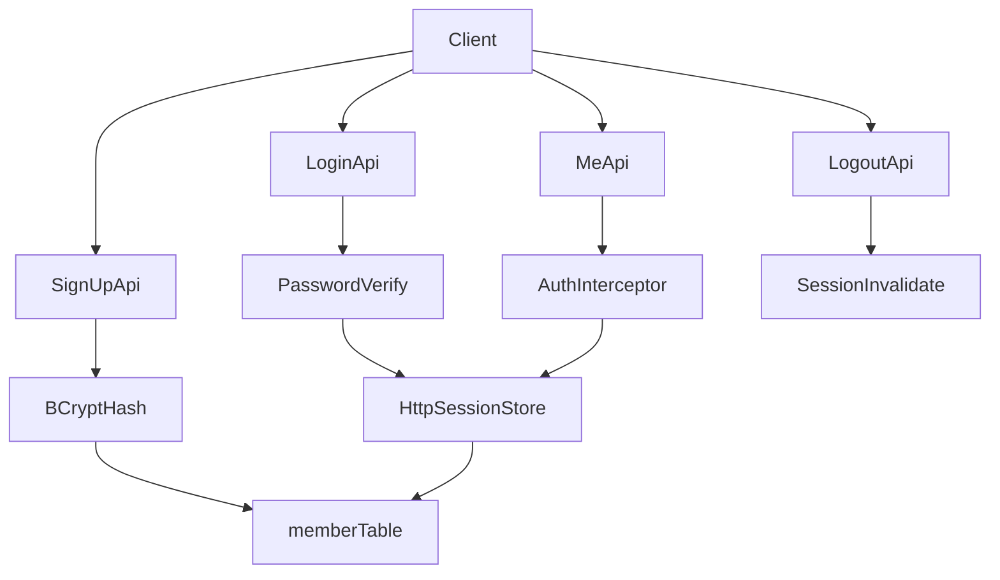

# auth-lab

## Spring Boot + PostgreSQL + MyBatis 기동 체크리스트 (1장)

아래 순서대로만 확인하면, 다음에 새 프로젝트를 만들어도 혼자서 기동할 수 있습니다.

### 1) 런타임/의존성
- [ ] Java 버전 확인 (`17+`)
- [ ] `build.gradle`에 아래 의존성 존재
  - [ ] `spring-boot-starter-web`
  - [ ] `org.postgresql:postgresql`
  - [ ] `org.mybatis.spring.boot:mybatis-spring-boot-starter`
  - [ ] `spring-boot-starter-validation`
  - [ ] `lombok`
- [ ] Gradle Reload 완료

### 2) DB 서버/접속 정보
- [ ] PostgreSQL 서버 실행 중 (예: Postgres.app `auth-lab`, port `5433`)
- [ ] 접속 정보 확정
  - [ ] host: `localhost`
  - [ ] port: `5433`
  - [ ] database: `auth_lab`
  - [ ] user: `sungyoung`
  - [ ] password: (비움)
- [ ] `psql`에서 확인
  - [ ] `\conninfo`
  - [ ] `SELECT current_user;`

### 3) application.yml
- [ ] 경로: `src/main/resources/application.yml`
- [ ] `spring.datasource.*` 키가 정확한 들여쓰기인지 확인
- [ ] `mybatis.mapper-locations` 설정 확인
- [ ] `application.properties`와 중복 사용하지 않음 (하나만 사용)

기준 예시:

```yaml
spring:
  datasource:
    url: jdbc:postgresql://localhost:5433/auth_lab
    username: sungyoung
    password:
    driver-class-name: org.postgresql.Driver

mybatis:
  mapper-locations: classpath:mapper/**/*.xml
  configuration:
    map-underscore-to-camel-case: true
```

### 4) 테이블/DDL (수동 관리 방식)
- [ ] `auth_lab` DB에 접속
- [ ] `member` 테이블 생성 SQL 실행
- [ ] `\dt`로 테이블 존재 확인
- [ ] 필요 시 `\d member`로 스키마 확인

### 5) MyBatis 스캔
- [ ] `@MapperScan("com.sungyoung.authlab.member.mapper")` 설정
- [ ] mapper 인터페이스 패키지와 경로 일치
- [ ] `src/main/resources/mapper/` 폴더 존재

### 6) 기동 확인
- [ ] `AuthLabApplication` 실행
- [ ] 로그에 `Started AuthLabApplication` 확인
- [ ] DB 연결 예외 없음

### 7) 에러 빠른 분류표
- `url attribute is not specified`
  - `application.yml` 들여쓰기/키 경로 문제
- `Failed to determine a suitable driver class`
  - PostgreSQL 드라이버 누락/미적용
- `Connection refused`
  - DB 서버 미기동, host/port 오타
- `password authentication failed`
  - username/password 불일치
- `relation "member" does not exist`
  - DDL 미실행
- `No qualifying bean ... Mapper`
  - `@MapperScan` 경로 또는 mapper 패키지 불일치

### 8) 최종 30초 점검
- [ ] 의존성
- [ ] DB 접속정보
- [ ] YAML 들여쓰기
- [ ] DDL 실행 여부
- [ ] MapperScan

이 5개만 맞으면 대부분 기동됩니다.

로그인/인증을 **직접 손코딩**하며 배우는 사이드 프로젝트입니다.

- **스택**: Spring Boot + MyBatis + **PostgreSQL** (현업과 동일)
- **0차 목표**: Spring 핵심 개념 (DI, 계층 구조, MyBatis) 실험으로 체득
- **1차 목표**: 세션 기반 회원가입 / 로그인 / 로그아웃 / 인가
- **2차 목표**: JWT Access Token 방식으로 확장
- **3차 목표**: Refresh Token (재발급 / 로그아웃)
- **학습 방식**: IntelliJ에서 직접 구현, 막히면 AI 멘토에게 단계별로 질문

---

## 현재 진행 상황

> 각 Step 완료 시 `[ ]` → `[x]` 로 직접 체크하세요.

| Step | 내용 | 상태 |
|------|------|------|
| 0 | 프로젝트 생성, DB 연결, 패키지 구조 | [x] |
| A | Spring 기초 실험 (DI, 계층 구조, MyBatis 흐름) | [x] |
| 1 | 회원가입 API (BCrypt) | [x] |
| 2 | 로그인 / 로그아웃 (HttpSession) | [x] |
| 3 | 인터셉터 인증 + role 인가 | [x] |
| 4 | Postman 전체 흐름 검증 | [x] |
| 5 | JWT Access Token | [x] |
| 6 | Refresh Token (재발급 / 로그아웃) | [~] 핵심 검증 완료 |

**현재 위치**: Step 6 — Refresh Token 핵심 시나리오 완료 (로테이션/로그아웃 추가 검증 권장)

### Step 6 세부 체크

- [x] 로그인 응답에 `accessToken` + `refreshToken`
- [x] Access로 `/api/members/me` → 200
- [x] Access 만료 후 `/me` → 401
- [x] `POST /api/auth/refresh`로 새 Access 발급
- [ ] 예전 refresh로 재호출 → 실패 (로테이션)
- [ ] `POST /api/auth/logout` 후 해당 refresh 재사용 불가

---

## 왜 이 순서인가?

1. **세션 먼저** — HTTP, 쿠키, 서버 상태 저장, 인증 흐름의 핵심을 가장 직관적으로 이해할 수 있습니다.
2. **Spring Security 없이** — 인증 원리를 직접 구현한 뒤, 나중에 Spring Security로 리팩터링하면 "프레임워크가 뭘 대신 해주는지"가 보입니다.
3. **JWT는 2차** — 세션을 이해한 뒤 JWT로 넘어가면 "왜 JWT를 쓰는지", "무엇을 직접 관리해야 하는지"가 선명해집니다.

---

## 핵심 개념 (미리 읽어두기)

| 용어 | 의미 |
|------|------|
| **인증 (Authentication)** | "너 누구야?" — 로그인으로 사용자 신원 확인 |
| **인가 (Authorization)** | "너 이거 해도 돼?" — 역할/권한에 따른 접근 허용 여부 |
| **BCrypt** | 비밀번호를 **해시**로 저장. 복호화가 아니라 `matches()`로 비교 |
| **HttpSession** | 서버가 로그인 상태를 기억하는 저장소. 클라이언트는 `JSESSIONID` 쿠키로 세션 ID 전달 |
| **401 Unauthorized** | 로그인하지 않음 |
| **403 Forbidden** | 로그인은 했지만 권한 없음 |

---

## API 목록 (최종 목표)

| Method | URL | 인증 | 설명 |
|--------|-----|------|------|
| POST | `/api/auth/sign-up` | X | 회원가입 |
| POST | `/api/auth/login` | X | 로그인 (세션 생성) |
| POST | `/api/auth/logout` | O | 로그아웃 (세션 무효화) |
| GET | `/api/members/me` | O | 내 정보 조회 |
| GET | `/api/admin/ping` | O (ADMIN) | 관리자 전용 API |

---

## 패키지 구조 (목표)

```
src/main/java/com/yourname/authlab/
├── AuthLabApplication.java
├── auth/
│   ├── controller/     # AuthController (sign-up, login, logout)
│   ├── service/        # AuthService (로그인 로직, 세션 처리)
│   └── dto/            # SignUpRequest, LoginRequest
├── member/
│   ├── controller/     # MemberController (GET /me)
│   ├── service/        # MemberService (회원 CRUD)
│   ├── dto/            # MemberDto
│   └── mapper/         # MemberMapper (MyBatis)
└── common/
    ├── config/         # MyBatisConfig, WebMvcConfig
    ├── exception/      # 공통 예외, ErrorResponse
    └── interceptor/    # LoginCheckInterceptor

src/main/resources/
├── application.yml
└── mapper/
    └── MemberMapper.xml
```

---

## Step 0. IntelliJ에서 프로젝트 만들기

### 0-1. 프로젝트 생성

1. IntelliJ → **New Project**
2. **Spring Boot** 선택
3. Location: `/Users/sungyoung/auth-lab/auth-lab`
4. Java **17+**, **Gradle**, Spring Boot **3.x**
5. Dependencies:
   - Spring Web
   - Validation
   - MyBatis Framework
   - Lombok
   - **PostgreSQL Driver**
6. **Create**

### 0-2. PostgreSQL DB 준비

**Postgres.app 사용 중 (현재 환경)**

스크린샷 기준으로 이미 준비되어 있습니다:

| 항목 | 값 |
|------|-----|
| 서버 | `auth-lab` (Postgres.app) |
| Port | **5433** |
| Database | **auth_lab** |
| Username | **sungyoung** (Postgres.app 기본 — macOS 계정명) |
| Password | 보통 없음 (로컬 trust 인증) |

→ **DB 생성은 건너뛰고** `application.yml` 연결만 맞추면 됩니다.

<details>
<summary>처음부터 만드는 경우 (참고)</summary>

```sql
CREATE DATABASE auth_lab;
-- Postgres.app은 macOS 계정(sungyoung)으로 자동 접속
```

Docker로 띄우려면:
`docker run -d --name authlab-pg -e POSTGRES_DB=auth_lab -e POSTGRES_USER=sungyoung -p 5433:5432 postgres:16`

</details>

### 0-3. 패키지 폴더 생성

위 [패키지 구조](#패키지-구조-목표)대로 `auth`, `member`, `common` 하위 폴더를 직접 만듭니다.

### 0-4. application.yml

```yaml
spring:
  datasource:
    url: jdbc:postgresql://localhost:5433/auth_lab
    username: sungyoung
    password:          # Postgres.app 로컬은 보통 비워둠
    driver-class-name: org.postgresql.Driver

mybatis:
  mapper-locations: classpath:mapper/**/*.xml
  configuration:
    map-underscore-to-camel-case: true
```

> 포트 `5433`, DB명 `auth_lab` — Postgres.app `auth-lab` 서버 기준

### 0-5. DB 편집기에서 수동 DDL 실행 (현업 방식)

Postgres.app / DBeaver / DataGrip에서 `auth_lab` DB에 접속해서 직접 실행:

```sql
CREATE TABLE IF NOT EXISTS member (
    id          BIGSERIAL PRIMARY KEY,
    login_id    VARCHAR(50)  NOT NULL UNIQUE,
    password    VARCHAR(255) NOT NULL,
    name        VARCHAR(50)  NOT NULL,
    role        VARCHAR(20)  NOT NULL DEFAULT 'USER',
    created_at  TIMESTAMP    NOT NULL DEFAULT CURRENT_TIMESTAMP
);
```

> 이 프로젝트는 `sql.init`를 사용하지 않고, DDL을 수동으로 관리합니다.

### 0-6. MyBatis Config

`common/config/MyBatisConfig.java`:

```java
@Configuration
@MapperScan("com.yourname.authlab.member.mapper")
public class MyBatisConfig {
}
```

> `com.yourname.authlab`는 본인 패키지명으로 변경

### Step 0 완료 체크

- [x] PostgreSQL `auth_lab` DB 준비 (Postgres.app, port 5433)
- [ ] DB 편집기에서 `member` 테이블 DDL 수동 실행
- [ ] Spring Boot 프로젝트 생성
- [ ] `./gradlew bootRun` 또는 IntelliJ Run으로 앱 기동 성공
- [ ] Postgres.app / psql에서 `member` 테이블 확인
- [ ] 패키지 구조 생성 완료

---

## Step A. Spring 기초 실험 (로그인 전 필수 이해)

> 이 단계를 건너뛰면 이후 코드를 "따라치기"만 하게 됩니다.
> 3개의 실험을 직접 손으로 만들고, **왜 이렇게 동작하는지** 설명할 수 있을 때 Step 1로 넘어가세요.

### 알아야 할 핵심 개념 4가지

| 개념 | 한 줄 설명 |
|------|-----------|
| **IoC / DI** | 객체를 내가 `new`로 만들지 않고 Spring이 만들어서 주입해준다 |
| **Spring Bean** | `@Service`, `@Component` 등 → Spring이 관리하는 객체 |
| **계층 구조** | Controller → Service → Mapper 순으로 역할 분리 |
| **MyBatis** | Mapper 인터페이스 + XML이 SQL과 연결되는 방식 |

---

### 실험 1. DI 체험 — `GET /api/hello`

**목표**: Controller가 Service를 주입받아 사용하는 흐름 직접 경험

만들 파일:
- `common/controller/TestController.java`
- `common/service/TestService.java`

핵심 질문 — 완성 후 스스로 대답할 수 있어야 함:
- `@RestController`와 `@Controller`의 차이는?
- `@RequiredArgsConstructor`가 없으면 어떻게 주입하나?
- Spring이 `TestService`를 어떻게 알고 주입하나?

완료 체크:
- [ ] `GET http://localhost:8080/api/hello` → `"hello"` 반환
- [ ] `TestService`를 `new`로 만들지 않았는데 동작함을 확인
- [ ] `@Service` 제거 후 에러 확인 → 다시 복원

---

### 실험 2. MyBatis 흐름 체험 — `member` 1건 조회

**목표**: Mapper 인터페이스 → XML → SQL 실행 흐름 직접 경험

만들 파일:
- `member/mapper/MemberMapper.java` (인터페이스)
- `resources/mapper/MemberMapper.xml`
- `member/dto/MemberDto.java`

핵심 질문 — 완성 후 스스로 대답할 수 있어야 함:
- `MemberMapper`는 인터페이스인데 어떻게 `@Autowired`가 되나?
- `@MapperScan`이 없으면 어떤 에러가 나나?
- XML의 `namespace`가 인터페이스 경로와 다르면 어떻게 되나?

완료 체크:
- [ ] psql에서 member 테이블에 테스트용 row 1건 INSERT
- [ ] `GET /api/test/member/{id}` → DB에서 조회한 결과 JSON 반환
- [ ] `@MapperScan` 경로 일부러 틀리게 → 에러 확인 → 복원

---

### 실험 3. 계층 완성 — Controller → Service → Mapper

**목표**: 3계층이 실제로 어떻게 협력하는지 손으로 완성

만들 파일:
- `member/service/MemberService.java`
- `member/controller/MemberController.java` (기존 TestController 대체 가능)

핵심 질문 — 완성 후 스스로 대답할 수 있어야 함:
- Controller에서 직접 Mapper를 써도 되는데 왜 Service를 끼우나?
- Service에 `@Transactional`이 왜 붙는 경우가 있나?
- 각 클래스에서 `@Autowired` 없이 의존성이 주입되는 이유는?

완료 체크:
- [ ] `GET /api/members/{id}` → Controller → Service → Mapper → DB → JSON 응답
- [ ] 각 계층 역할을 말로 설명할 수 있음

---

### Step A 완료 기준

아래를 **말로 설명**할 수 있으면 Step 1로 이동:

1. `@Service`가 있어야 Spring이 빈으로 등록하는 이유
2. 생성자 주입이 `@Autowired` 필드 주입보다 권장되는 이유
3. `MemberMapper` 인터페이스가 구현체 없이 동작하는 원리
4. Controller / Service / Mapper 각각 왜 분리하는지

---

## Step 1. 회원가입 API

### 만들 파일

| 파일 | 위치 | 역할 |
|------|------|------|
| `SignUpRequest.java` | `auth/dto/` | loginId, password, name + `@NotBlank` |
| `MemberDto.java` | `member/dto/` | DB 조회 결과 매핑 |
| `MemberMapper.java` | `member/mapper/` | MyBatis 인터페이스 |
| `MemberMapper.xml` | `resources/mapper/` | insert, findByLoginId SQL |
| `MemberService.java` | `member/service/` | 중복 체크 + BCrypt 해시 + 저장 |
| `AuthController.java` | `auth/controller/` | `POST /api/auth/sign-up` |

### BCrypt 의존성 (build.gradle)

```groovy
implementation 'org.springframework.security:spring-security-crypto'
```

> Spring Security 전체가 아니라 **crypto만** — 학습용으로 충분

### 구현 포인트

```java
// MemberService.signUp() 흐름
1. findByLoginId(loginId) → 이미 있으면 예외
2. BCryptPasswordEncoder.encode(password) → 해시
3. MemberMapper.insert(dto) → DB 저장
```

### Postman 테스트

```
POST http://localhost:8080/api/auth/sign-up
Content-Type: application/json

{
  "loginId": "testuser",
  "password": "password123",
  "name": "테스트"
}
```

### Step 1 완료 체크

- [ ] 회원가입 성공 (201 또는 200)
- [ ] DB `password` 컬럼이 `$2a$...` 형태의 해시
- [ ] 같은 loginId 재가입 시 에러 응답

---

## Step 2. 로그인 / 로그아웃

### 만들 파일

| 파일 | 역할 |
|------|------|
| `LoginRequest.java` | loginId, password |
| `AuthService.java` | 회원 조회 → BCrypt 비교 → 세션 저장 |
| `AuthController` 추가 | login, logout 엔드포인트 |

### 로그인 흐름

```java
// AuthService.login()
1. findByLoginId(loginId) → 없으면 "아이디 또는 비밀번호가 올바르지 않습니다"
2. passwordEncoder.matches(입력비번, DB해시) → false면 같은 메시지
3. HttpSession session = request.getSession(true);
   session.setAttribute("memberId", member.getId());
   session.setAttribute("role", member.getRole());
```

> 실패 메시지를 "아이디 없음" / "비밀번호 틀림"으로 나누지 않기 — 공격자에게 힌트 주지 않기

### 로그아웃

```java
HttpSession session = request.getSession(false);
if (session != null) {
    session.invalidate();
}
```

### Postman에서 꼭 확인

로그인 성공 후 **Cookies 탭**에 `JSESSIONID`가 생기는지 확인.
이후 API 호출 시 이 쿠키가 자동으로 전송됩니다.

### Step 2 완료 체크

- [ ] 로그인 성공 → `JSESSIONID` 쿠키 발급
- [ ] 잘못된 비밀번호 → 실패 (구체적 메시지 X)
- [ ] 로그아웃 → 세션 무효화

---

## Step 3. 인증 / 인가

### 만들 파일

| 파일 | 역할 |
|------|------|
| `LoginCheckInterceptor.java` | 세션에 memberId 없으면 401 |
| `WebMvcConfig.java` | 인터셉터 등록, `/api/auth/**` 제외 |
| `MemberController.java` | `GET /api/members/me` |
| `AdminController.java` | `GET /api/admin/ping` (ADMIN만) |

### LoginCheckInterceptor 핵심

```java
@Override
public boolean preHandle(HttpServletRequest request, HttpServletResponse response, Object handler) {
    HttpSession session = request.getSession(false);
    if (session == null || session.getAttribute("memberId") == null) {
        response.setStatus(HttpServletResponse.SC_UNAUTHORIZED); // 401
        return false;
    }
    return true;
}
```

### WebMvcConfig — 인터셉터 등록

```java
registry.addInterceptor(loginCheckInterceptor)
    .addPathPatterns("/api/**")
    .excludePathPatterns("/api/auth/**");  // sign-up, login은 인증 불필요
```

### AdminController — role 검사

```java
String role = (String) session.getAttribute("role");
if (!"ADMIN".equals(role)) {
    response.setStatus(HttpServletResponse.SC_FORBIDDEN); // 403
    return;
}
```

### Step 3 완료 체크

- [ ] 로그인 없이 `/api/members/me` → 401
- [ ] 로그인 후 `/api/members/me` → 내 정보 반환
- [ ] USER가 `/api/admin/ping` → 403
- [ ] ADMIN으로 `/api/admin/ping` → 200

---

## Step 4. Postman 전체 흐름 검증

아래 시나리오를 **순서대로** 실행:

```
1. POST /api/auth/sign-up     → testuser / password123
2. POST /api/auth/login       → JSESSIONID 쿠키 확인
3. GET  /api/members/me       → 200, 내 정보
4. POST /api/auth/logout
5. GET  /api/members/me       → 401
6. DB에 ADMIN 계정 INSERT      → role = 'ADMIN'
7. ADMIN으로 login → GET /api/admin/ping → 200
8. USER로 login    → GET /api/admin/ping → 403
```

### Step 4 완료 = 1차 목표 달성

---

## Step 5. JWT Access Token (2차 연습)

세션 버전이 완벽히 동작한 뒤 진행. → **완료**

### 세션 vs JWT 비교

| | 세션 | JWT |
|--|------|-----|
| 상태 저장 | 서버 (메모리/Redis) | 클라이언트 (토큰) |
| 확장성 | 서버 여러 대면 세션 공유 필요 | Stateless, 확장 쉬움 |
| 로그아웃 | 세션 삭제로 즉시 무효화 | Access만 있으면 만료 전까지 유효 |
| 구현 난이도 | 쉬움 | 중간 (만료, 재발급 직접 관리) |

### 구현 포인트

- `jjwt` 의존성 + `JwtProvider`
- 로그인 성공 시 Access Token 발급 (`LoginResponse`)
- `LoginCheckInterceptor`에서 `Authorization: Bearer {token}` 검증
- role은 JWT claim 스냅샷 → DB role 변경 후 **재로그인/재발급**해야 반영

### Step 5 완료 체크

- [x] 로그인 Body에 `accessToken`
- [x] Bearer로 `/me` → 200
- [x] Header 없이 `/me` → 401
- [x] ADMIN Bearer로 `/admin/ping` → 200
- [x] DB role만 바꾸고 예전 토큰 → 권한 미반영 (재로그인 후 반영) 확인

---

## Step 6. Refresh Token (3차 연습)

Access만으로는 만료 시 재로그인·서버 측 로그아웃이 어렵기 때문에 Refresh를 DB에 둡니다.

```
Access  = 짧게, API용 JWT (서버에 안 저장)
Refresh = 길게, UUID를 DB(refresh_token)에 저장 → 재발급/로그아웃
```

### 구현 요약

- 테이블: `refresh_token` (member_id, token, expires_at)
- 로그인: `accessToken` + `refreshToken` 응답, refresh는 DB insert
- `POST /api/auth/refresh`: DB 조회 → 유효하면 새 Access(+ 로테이션 시 새 Refresh)
- `POST /api/auth/logout`: DB에서 refresh 삭제
- 인터셉터 제외: `/api/auth/refresh`, `/api/auth/logout`
- `@Value("${jwt.refresh-expiration-ms}")` — `jwt.` 접두사 주의

### Postman 시나리오

```
1. POST /api/auth/login          → access + refresh
2. GET  /api/members/me          → Bearer access → 200
3. Access 만료 후 /me            → 401
4. POST /api/auth/refresh        → 새 access (+ 새 refresh)
5. 예전 refresh로 /refresh       → 실패 (로테이션)
6. POST /api/auth/logout         → refresh 삭제
7. 로그아웃한 refresh로 /refresh → 실패
```

### Step 6 완료 체크

- [x] 로그인에 access + refresh
- [x] 만료 Access → 401
- [x] refresh로 재발급 성공
- [ ] 로테이션 / 로그아웃 추가 검증

---

## 전체 흐름도 (세션 1차)



---

## AI 멘토에게 질문하는 방법

다음에 Cursor에서 이어서 진행할 때:

| 상황 | 이렇게 물어보기 |
|------|----------------|
| 단계 시작 | `"Step 1 시작할게, 뭐부터 만들면 돼?"` |
| 에러 발생 | `"Step 2에서 이 에러 났어: ..."` |
| 코드 리뷰 | `"내 AuthService 코드 봐줘"` (+ 파일 경로) |
| 개념 이해 | `"BCrypt matches()가 어떻게 동작해?"` |
| 다음 단계 | `"Step 3 완료 체크 다 했어, 다음으로 가도 될까?"` |

> README의 **현재 진행 상황** 테이블도 함께 업데이트하면 AI가 어디까지 했는지 바로 파악합니다.

---

## Definition of Done (1차 목표 — 세션)

- [x] 회원가입이 된다
- [x] 비밀번호가 BCrypt 해시로 저장된다
- [x] 로그인 성공 시 HttpSession이 생성된다
- [x] 로그인하지 않으면 보호 API가 **401**을 반환한다
- [x] 일반 USER가 관리자 API 호출 시 **403**을 반환한다
- [x] 로그아웃 후 보호 API 재호출 시 다시 **401**이 반환된다

## Definition of Done (2~3차 — JWT)

- [x] Access Token 발급 및 Bearer 인증
- [x] JWT claim 기반 인가 (role 스냅샷 이해)
- [x] Access 만료 후 Refresh로 재발급
- [ ] Refresh 로테이션 / 로그아웃으로 서버 측 무효화 확인

---

## 이후 확장

- [x] Refresh Token (Step 6 — 핵심 완료, 로테이션/로그아웃 추가 검증 권장)
- [ ] 비밀번호 변경
- [ ] Remember-me / 자동 로그인
- [ ] Spring Security로 리팩터링
- [ ] OAuth2 소셜 로그인 (Google, Kakao 등)
- [ ] 이메일 인증 / 휴면 계정 처리
